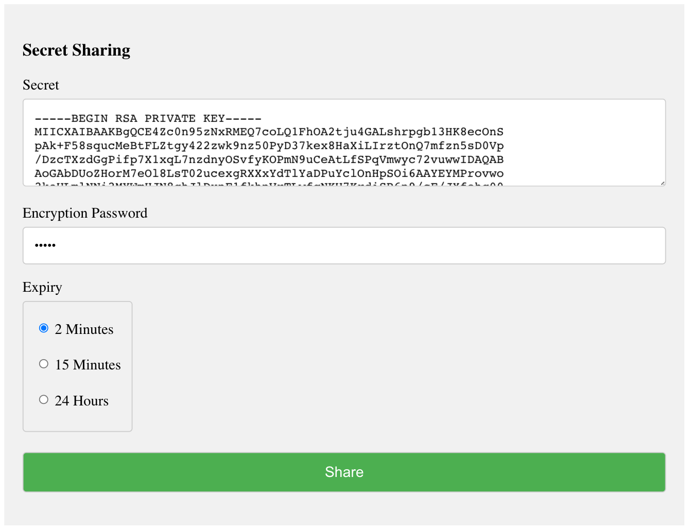

https://shhh.boost.workers.dev/

# Get Started

1. `npm i` to install wrangler CLI
2. Rename `wrangler.example.toml` to `wrangler.toml` and update account ID
3. `wrangler login`
4. `wrangler publish`
5. Open URL

# Features

- HTTPS and AES256-GCM encryption
- Password Encryption from a PBKDF2 Derived Key
